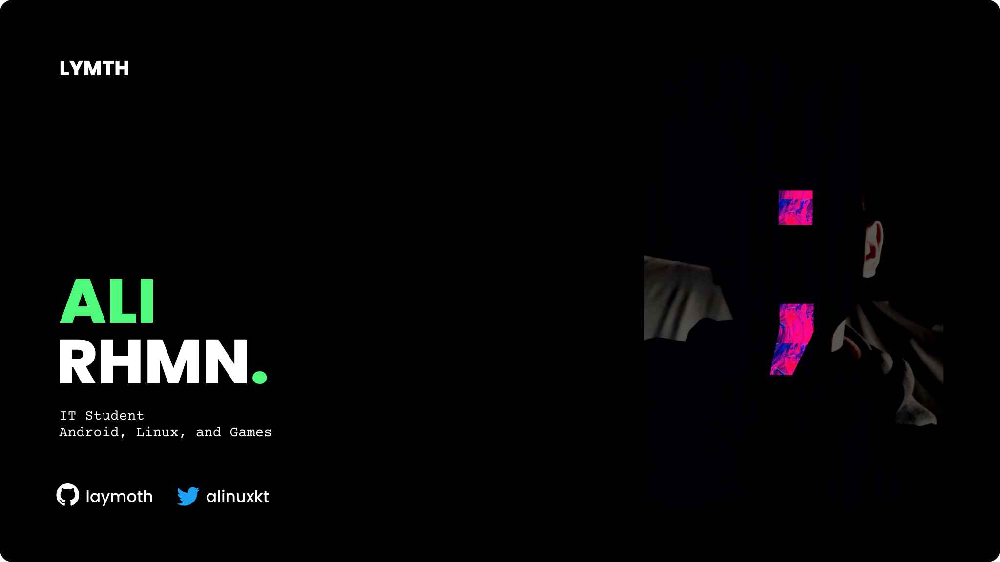

<b>「</b>

  

   <samp>0x0</samp>
  

   
  

  <a href="https://github.com/laymoth">
    
     
    
    
  </a>

    

<b>」</b>

**📝 Latest Blog Posts**
<!-- BLOG-POST-LIST:START -->
- [Macam Macam Percabangan Dan Perulangan](https://laymoth.github.io/macam-macam-percabangan-dan-perulangan/)
- [Tiga Algoritma Dasar](https://laymoth.github.io/tiga-algoritma-dasar/)
- [Pohon Biner](https://laymoth.github.io/pohon-biner/)
- [Fungsi](https://laymoth.github.io/fungsi/)
- [Relasi](https://laymoth.github.io/relasi/)
- [Aljabar Boolean](https://laymoth.github.io/aljabar-boolean/)
<!-- BLOG-POST-LIST:END -->
